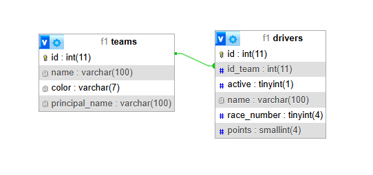

# Tabla Posiciones F1 / F1 standings
- [Español](#descripción)
    - [Descripción](#descripción)
    - [Integrantes](#integrantes)
    - [Temática](#temática)
    - [Diagrama de Entidad-Relación](#diagrama-de-entidad-relación)

- [English](#description)
    - [Description:](#description)
    - [Members:](#members)
    - [Theme](#theme)
    - [Entity-Relationship Diagram](#entity-relationship-diagram)

----------------------------------
## Descripción
Este proyecto fue desarrollado como trabajo práctico especial para la materia WEB-2 (TUDAI).

## Integrantes:
-  Sergio Zampieri - <a href="mailto:gersio.zampieri@gmail.com">gersio.zampieri@gmail.com</a>

## Temática:

Visualización de posiciones de una temporada de [Formula 1](https://www.formula1.com/).

Además, esta aplicación web permitirá la creación, carga de datos, modificación y eliminación de equipos y corredores, así como también la asociación de corredores a un equipo determinado.

## Diagrama de Entidad-Relación

Modificar o eliminar un equipo implica la desvinculación de sus corredores, por lo que convertir el campo `id_team` a `NULL` se considera la opción correcta.

----------------------------------

## Description

This project was developed as a special assignment for the WEB-2 course (TUDAI).

## Members:

Sergio Zampieri - <a href="mailto:gersio.zampieri@gmail.com">gersio.zampieri@gmail.com
</a>

## Theme:

Display of standings related to a [Formula 1](https://www.formula1.com/) season.

Additionally, this web app will support the creation, data entry, modification, and deletion of teams and drivers, as well as the management of driver-team associations.

## Entity-Relationship Diagram

Modifying or deleting a team will disassociate its drivers, so setting the `id_team` field to `NULL` is considered the correct approach.

