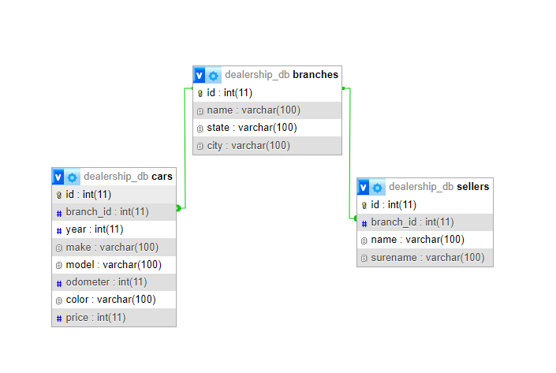

# TPE 2024

## Primera parte - Dominio

### Descripción:
Se implemento la base de datos **dealership_db** mediante MyPhpAdmin. Esta DB está orientada a representar una red de consecionarias, en las que se mostrara (por sucursal) los vehiculos en stock, asi como tambien los vendedores que trabajan en las mismas.

### Estructura:
Esta red esta vinculada de la siguiente manera:

- Branches: Hace referencia a las distintas sucursales pertenecientes a la red de consecionarias.
- Cars: Hace referencia a los distintos modelos que tiene en stock cada consecionaria.
- Sellers: hace refercia a los distintos vendedores que trabajan en cada consecionaria.
